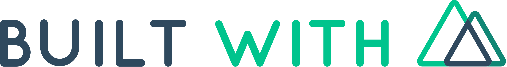

<h1 align="center">


<br/>


</h1>

<p align="center">
  StudyTech - Portal de de estudos 📰🚀
  <br>
  <br>


  <a href="https://rocketseat.com.br">
    
  </a>

  <a href="https://www.linkedin.com/in/thiago-freitas-carneiro-39359270/">
    
  </a>

  
</p>

---

<p align="center">
  <a href="#dart-sobre">Sobre</a> &#xa0; | &#xa0; 
  <a href="#rocket-tecnologias">Tecnologias</a> &#xa0; | &#xa0;
  <a href="#white_check_mark-requerimentos">Requerimentos</a> &#xa0; | &#xa0;
  <a href="#checkered_flag-começando">Começando</a> &#xa0; &#xa0; | &#xa0;
  <a href="#framed_picture-imagens">Imagens</a> &#xa0; &#xa0;
</p>

<br>


## :dart: Sobre ##


O Projeto estudytTech é uma plataforma de cursos de tecnologia. Os conteúdos são visualizados na tela principal de forma interativa, indicando as referências de cada conteúdo, se o mesmo se trata de uma mídia ou imagem, se aquele conteúdo possui um link ou documento. Impactando a primeira vista o que aquele determinado conteúdo oferece.
<br>

<br>

<br>


## 🧪 Tecnologias ##

As seguintes tecnologias foram utilizadas no projeto:

- [Nuxt.js](https://nuxtjs.org/)
- [GraphQL](https://graphql.org/)
- [SASS](https://sass-lang.com/)
- [JEST](https://jestjs.io/pt-BR/)


## :white_check_mark: Requerimentos ##

- [Node](https://nodejs.org/en/)
- [Yarn](https://yarnpkg.com/lang/en/)
- [Vue CLI](https://cli.vuejs.org/)


## :checkered_flag: Começando ##

```bash
# Clone this project
$ git clone https://github.com/thiagofreitascarneiro/challenge-vue
# Access
$ cd challenge-vue
# Install dependencies
$ yarn install
# Run the project
$ yarn dev
# The server will initialize in the <http://localhost:3000>
```
## :framed_picture: Imagens ##


